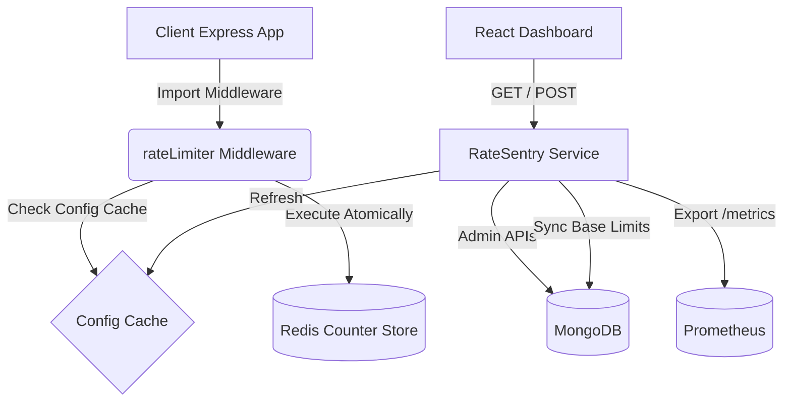

# RateSentry 🛡️

A production-ready Distributed Rate Limiter as a Service built with Node.js, Redis, and MongoDB. It acts as both a standalone microservice with an Admin Dashboard and an exportable Express middleware that any other app can import and plug into seamlessly.

---

## 🏗️ Architecture



---

## 🧠 Core Algorithms

### The Sliding Window Log Explained Simply
Standard rate limiting algorithms (like Fixed Window) have a flaw: if your limit is 100 requests per minute, a user can spam 100 requests at 12:00:59, and another 100 at 12:01:00. This results in 200 requests within just 2 seconds, despite the "100/min" rule!

The **Sliding Window Log** solves this by tracking the exact timestamp of *every* request.
1. When a request comes in, we log its timestamp in a Redis Sorted Set.
2. We then look exactly 60 seconds back in time from *right now*.
3. We delete any timestamps older than that line.
4. If the number of timestamps remaining is less than the limit, the request is allowed.

This creates a perfectly smooth, sliding window that cannot be "tricked" at the edge of arbitrary minute barriers.

---

## 🚀 Setup Instructions

We use `docker-compose` to spin up MongoDB, Redis, Prometheus, and the Node.js Service simultaneously.

```bash
# 1. Start the backend infrastructure
docker-compose up -d --build

# 2. Start the Admin Dashboard
cd dashboard
npm install
npm run dev
```

The Service runs on `http://localhost:3000`.
The Dashboard runs on `http://localhost:5173`.
Prometheus metrics are mapped to `http://localhost:9090`.

---

## 🔌 Integrating the Middleware

This package exports an Express middleware that you can easily plug into *any* other application, without needing to spin up Docker or set environment variables if you use standalone mode.

```bash
npm install ratesentry
```

### Simple Standalone Usage (No DB/Docker required)
You can directly provide your Redis connection string and bypass MongoDB checks entirely!

```typescript
import express from 'express';
import { rateLimiter } from 'ratesentry';

const app = express();

app.use('/api', rateLimiter({ 
  redisUrl: 'redis://your-redis-host:6379',
  algorithm: 'sliding-window',
  standalone: true,  // Bypasses MongoDB and dashboard integration
  limit: 100,        // 100 requests
  windowMs: 60000    // per minute
}));

app.get('/api/data', (req, res) => res.send('Protected Data'));
```

### Full Distributed Setup with Dashboard
If you want to use the Admin Dashboard, Tier Limits, and IP Blacklisting, use the default mode:

```typescript
import express from 'express';
import { rateLimiter } from 'ratesentry'; 

const app = express();

// Expects process.env.REDIS_URL and MongoDB to be running
app.use('/api', rateLimiter({ algorithm: 'sliding-window', defaultTier: 'free' }));
```

---

## 📖 API Documentation

### Rate Limiter Middleware Responses
When limited, the middleware returns HTTP status `429 Too Many Requests`.
It automatically appends the following headers to help clients:
- `X-RateLimit-Limit`: Maximum requests permitted.
- `X-RateLimit-Remaining`: Remaining requests for the window.
- `X-RateLimit-Reset`: Timestamp of when the limit resets.
- `Retry-After`: Seconds to wait before retrying (Required by HTTP spec).

### Admin REST API Endpoints (`Base: http://localhost:3000/admin`)

- **`GET /stats`**: Returns aggregations of client/rule counts.
- **`GET /clients`**: Returns all managed clients and their tiers.
- **`POST /clients`**: Create a new API Client. 
  - *Payload*: `{ "name": "App Frontend", "tierId": "<ObjectId>" }`
- **`GET /tiers`**: Returns pricing tiers (Free, Pro, Enterprise).
- **`POST /tiers`**: Create a custom Tier limit.
  - *Payload*: `{ "name": "pro", "requestsPerMin": 1000 }`
- **`GET /rules`**: Gets IP Whitelist and Blacklists.
- **`POST /rules`**: Create a security rule.
  - *Payload*: `{ "type": "BLACKLIST", "ipAddress": "192.168.1.1" }`


