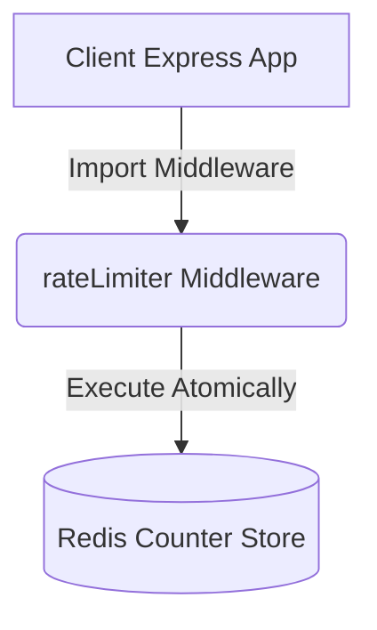

# RateSentry 🛡️

A simple, fast, and production-ready Express middleware for Distributed Rate Limiting using Redis.

---

## 🏗️ Architecture



---

## 🧠 Core Algorithms

### The Sliding Window Log Explained Simply
Standard rate limiting algorithms (like Fixed Window) have a flaw: if your limit is 100 requests per minute, a user can spam 100 requests at 12:00:59, and another 100 at 12:01:00. This results in 200 requests within just 2 seconds, despite the "100/min" rule!

The **Sliding Window Log** solves this by tracking the exact timestamp of *every* request.
1. When a request comes in, we log its timestamp in a Redis Sorted Set.
2. We then look exactly 60 seconds back in time from *right now*.
3. We delete any timestamps older than that line.
4. If the number of timestamps remaining is less than the limit, the request is allowed.

This creates a perfectly smooth, sliding window that cannot be "tricked" at the edge of arbitrary minute barriers.

---

## 🚀 Installation

```bash
npm install ratesentry
```

*Note: You will need a running Redis server.*

---

## 🔌 Usage

This package exports an Express middleware that you can plug into your application to easily implement rate limiting.

### Basic Setup

You can directly provide your Redis connection string to configure the limiter:

```javascript
const express = require('express');
const { rateLimiter } = require('ratesentry');

const app = express();

app.use('/api', rateLimiter({ 
  redisUrl: 'redis://localhost:6379',
  algorithm: 'sliding-window', // 'sliding-window', 'fixed-window', or 'token-bucket'
  standalone: true,  
  limit: 100,        // Allow 100 requests
  windowMs: 60000    // Per 60,000 milliseconds (1 minute)
}));

app.get('/api/data', (req, res) => res.send('Protected Data'));

app.listen(3000, () => console.log('Server running on port 3000'));
```

---

## 📖 API Documentation

### Configuration Options
* **`redisUrl`**: Your Redis connection string (e.g., `redis://localhost:6379`).
* **`algorithm`**: The rate limiting algorithm to use (`'sliding-window'`, `'fixed-window'`, or `'token-bucket'`).
* **`standalone`**: Must be `true` for simple Redis usage (disables external DB checks).
* **`limit`**: Maximum number of requests permitted within the window.
* **`windowMs`**: The timeframe in milliseconds.

### Middleware Responses
When a client goes over the limit, the middleware automatically rejects the request with HTTP status `429 Too Many Requests`.

It also appends the following headers to help clients manage their usage:
- `X-RateLimit-Limit`: Maximum requests permitted.
- `X-RateLimit-Remaining`: Remaining requests for the window.
- `X-RateLimit-Reset`: Timestamp of when the limit resets.
- `Retry-After`: Seconds to wait before retrying (Required by HTTP spec).